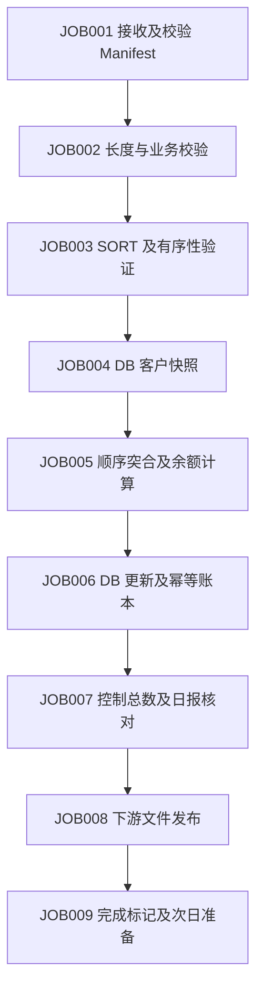

# 银行夜间批处理案例设计

状态：待实现的课程案例规格。字段、状态和 RC 是本课程约定，不宣称等同任何实际银行系统。

## 1. 业务模型与运行边界

一个客户可以有多个账户，一个账户每天可以有多笔交易。客户 DB 保存区分、状态、风险等级及版本；账户 Master 保存期初余额；Transaction 保存当日不可变交易。夜间处理生成期末 Master、拒绝交易、异常账户、日报及下游文件。Previous Day 用于对照昨日状态，DB Snapshot 是本次运行固定的客户视图。

营业日由参数显式给出，不能默认使用机器当前日期。run_id 标识尝试次数；业务幂等键由 business_date、transaction_id、业务版本定义。首次课程只处理一种币种；多币种扩展必须按币种分别核对，不能直接加总。

账户关闭、冻结、透支等具体业务政策必须在对应练习说明里给出；不允许学员根据状态字母自行猜测。

## 2. 基础文件契约

文本定宽接口使用 ASCII 合成数据；名称字段实验先限制 ASCII，以免把字符数误当字节数。多字节/EBCDIC 是单独实验。每条逻辑记录之后采用 LF；LF 不计入记录长度。Packed Decimal/二进制实验写入原始字节文件，不能使用文本逐行处理假定。

### CUSTOMER v1：27 字节

| 位置（1 起） | 长度 | 字段 | 表示/规则 |
|---|---:|---|---|
| 1–8 | 8 | customer_id | 8 位数字，保留前导零，唯一 |
| 9–18 | 10 | customer_name | ASCII、右侧空格补齐、必填 |
| 19–26 | 8 | balance_demo | 基础实验金额，单位分、无符号；不是最终账户账本 |
| 27 | 1 | status | A 有效、D 停用；其他拒绝 |

此布局用于用户提供的定长样例。进入账户模型后余额移入 ACCOUNT；演进原因和迁移步骤必须讲清，不能静默更改文件含义。

### ACCOUNT v1：47 字节

| 位置 | 长度 | 字段 | 规则 |
|---|---:|---|---|
| 1–10 | 10 | account_id | 数字键，唯一 |
| 11–18 | 8 | customer_id | 引用客户 |
| 19–21 | 3 | currency | 首期 JPY；课程统一最小单位，不隐式换汇 |
| 22–22 | 1 | balance_sign | + 或 -，文本接口明确保存 |
| 23–35 | 13 | opening_balance | 整数最小单位，边界和溢出须验证 |
| 36–36 | 1 | account_status | A 正常、F 冻结、C 关闭 |
| 37–44 | 8 | business_date | YYYYMMDD，按课程日历验证 |
| 45–47 | 3 | layout_version | 001 |

### TRANSACTION v1：55 字节

| 位置 | 长度 | 字段 | 规则 |
|---|---:|---|---|
| 1–10 | 10 | account_id | 突合键 |
| 11–26 | 16 | transaction_id | 业务幂等键组成部分 |
| 27–34 | 8 | business_date | 必须匹配作业营业日 |
| 35–40 | 6 | sequence_no | 同账户处理顺序，不依赖 SORT 偶然次序 |
| 41 | 1 | direction | C 入账、D 出账 |
| 42–54 | 13 | amount | 最小单位、非负、零金额政策单独定义 |
| 55 | 1 | status | N 待处理；重复/其他状态政策明确 |

账户按 account_id 排序；交易按 account_id、sequence_no、transaction_id 排序。重复 account_id 的 Master 属业务异常，不能任取一条。重复 transaction_id 的交易不得再次记账。

生产练习不能只依赖 PIC 接收后的内容判断原始记录长度；须在校验边界取得原始字节长度。短/长记录不能被静默填充或截断后当作有效数据。

## 3. 150+ 字段记录的要求

业务扩展记录至少有 150 个具名叶子字段，分为身份、地址/联系、账户属性、客户分类、风险/合规、限额、渠道权限、业务日期、版本/审计等组。字段目录必须给出：稳定 field_id、COBOL 名称、业务名、组路径、PIC/USAGE、字节偏移/长度、单位、是否可空、默认值、合法范围、敏感级别、比较策略、接口版本。

此阶段不先手写一个虚构总长度；总长必须由完整字段目录与锁定 ABI 验证后发布。REDEFINES/OCCURS 不重复误算；FILLER 不计入 150 个业务字段。

差异比较有三种显式策略：原始字节比较、规范化文本比较、解码后数值比较。忽略字段（例如运行时间戳）须有业务理由。输出差异包含 run_id、业务键、field_id、字段名、位置、旧/新值、策略和来源版本；敏感字段提供脱敏演练。

## 4. 顺序突合算法契约

### L1：1:1

Master 与 Transaction 的键唯一且分别有序；两个读取指针比较键：相等输出 MATCH 并推进两边；Master 小输出 MASTER ONLY 并推进 Master；Transaction 小输出 TRANSACTION ONLY 并推进交易。一边 EOF 后清空另一边剩余流。EOF 使用独立状态，不用可能出现在真实键中的哨兵值冒充 EOF。

计数恒等式：Master 笔数 = MATCH + MASTER ONLY；Transaction 笔数 = MATCH + TRANSACTION ONLY。空/空、空/非空、非空/空、首尾孤立键、全匹配、完全不匹配必须有夹具。

### L2：1:N

Master 账户唯一，交易按账户分组；消费同键交易组并按 sequence_no 应用。内存保存单个账户的累计状态，不保存整份文件。每个账户核对：期末余额 = 期初余额 + 接收入账 − 接收出账；拒绝交易不能进入金额累计。单条和累计溢出分别处理。

### L3：多文件与 N:N

Master、交易、DB Snapshot、Previous Day 各有键和基数；先写关联规则和状态转换表，再实现。若同键两侧都多条，必须明确逐序号配对、聚合后比较或业务授权的多重关联，禁止默认笛卡尔积。必须明确无客户、无账户、前日缺失和快照日期不一致的处理。

### L4：大记录差异

先比较键与布局版本，再比较字段。原始值和数值相等性不同；小数缩放、尾空格、符号、无效字节和 NULL 不得混淆。验收使用独立定义的变更字段清单，验证全部差异且无额外误报。

## 5. JOB Flow

| JOB | 输入 | 输出/检查点 | 失败后原则 |
|---|---|---|---|
| 001 | 接收目录、Manifest | 不可变输入快照、校验和 | 不进入校验 |
| 002 | 快照、布局契约 | 有效/拒绝数据、控制总数 | 按拒绝政策 RC4 或 RC8 |
| 003 | 有效记录 | 排序文件、有序性证据 | 临时空间失败 RC12，无正式产物 |
| 004 | 营业日、DB | 带版本/截止点的快照 | 连接失败不使用过期数据冒充本日 |
| 005 | 四类已验证流 | 候选期末 Master、突合/差异报告 | 候选隔离，不发布 |
| 006 | 候选变更、幂等键 | DB 提交标识、应用账本 | 判断是否已经提交后再恢复 |
| 007 | 明细、拒绝、DB 标识 | 笔数及金额核对证据 | 不通过不能发布 |
| 008 | 已核对候选 | 正式下游文件、发布 Manifest | 已提交 DB 时恢复发布，不重新扣款 |
| 009 | 全部完成证据 | 作业完成状态 | 状态可查，不覆盖原运行记录 |

## 6. RC、配置和日志

RC0 正常；RC4 按契约允许的 Warning；RC8 业务异常；RC12 系统异常。非约定进程退出码保留原始值，在 Shell 边界映射为 RC12 并记录，不把操作系统信号伪装成业务拒绝。

每个 JOB 声明允许的前置 RC 集合；默认仅 RC0 可继续。参数优先级为 CLI > 参数文件 > 明确默认值；环境变量只承担约定配置。必要参数包含营业日、run_id、输入/输出/临时/日志路径、布局版本和 DB 配置入口。凭据不得写入源码、日志或课程数据。

日志至少包含时间及时区、营业日、run_id、job_id、阶段、源/输出校验和、计数、金额汇总、原始/映射 RC、开始/结束状态。成功日志不替代业务核对。

## 7. 重跑与恢复

输入快照不可变；锁按营业日/系统范围取得，并记录持有者与有效性。临时输出在独立 run 目录生成，校验后通过受控发布切换正式指针。原子重命名只解决相应文件系统范围，不能自动解决 DB 与文件的一致性。

四个强制崩溃点：DB 提交前、提交后未写本地检查点、文件生成后未发布、发布后未写完成状态。恢复通过 DB 幂等账本、提交标识、输出 Manifest 和校验和核实事实，不凭 Shell 日志最后一行推断事务状态。

重跑分为失败阶段恢复、从快照重建派生文件、业务更正运行三类。业务更正必须有新业务版本和审计关系；禁止简单删除完成标记后再次应用交易。

## 8. DB 模型与技术验证

课程逻辑表：customer、account、transaction_ledger、batch_run、batch_commit；种子数据及约束必须入仓。transaction_ledger 有明确唯一业务键。DB 更新和幂等记录在同一事务中；Cursor 快照的一致性策略须说明。

Embedded SQL 的具体安装、预编译和错误码由 P1 验证后锁定。PostgreSQL 作为建议基线；不能把其他 DB 的 SQLCODE -803 直接写成其实际错误码。需要演练唯一约束根因，并提供平台错误映射表。

## 9. 规模与正确性档位

- 微型：0～20 行，可人工逐行核算，全部 EOF 和边界场景。
- 中型：1 万账户、10 万交易，用于流程和统计验收。
- 压力：10 万账户、100 万交易，验证核心突合的有界内存与临时空间处理。

每档记录 seed、业务分布、文件大小、校验和、预期计数及金额。具体时间/RSS 阈值由 P1 在注明硬件后确定。大量数据不得只验“程序没有崩溃”。
